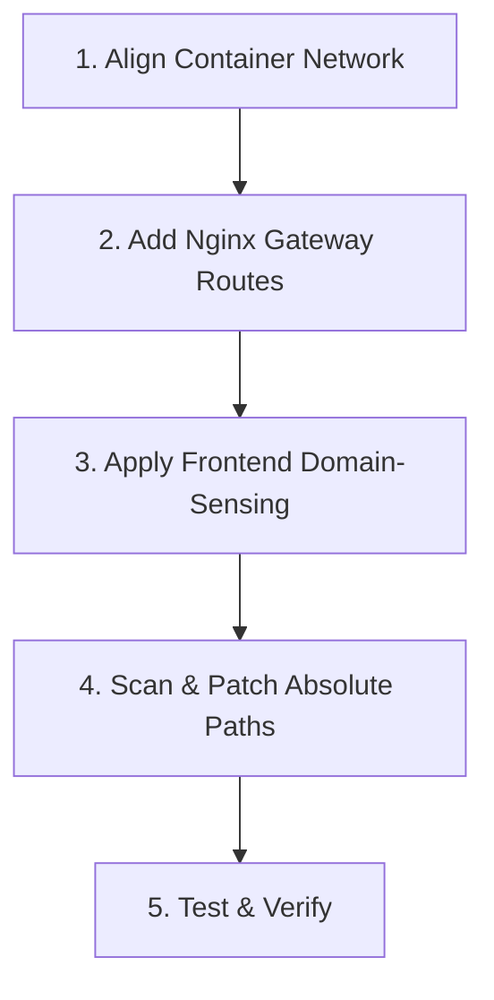

# 🚀 Single-Domain Multi-Service (mysingledomain2mul)

This skill provides comprehensive architectural guidelines, production-ready templates, and troubleshooting checklists for hosting multiple containerized microservices under a **single public entrance domain** (e.g., a single Ngrok tunnel, a public IP, or a domain) without opening additional firewall ports or paying for multiple tunnels.

---

## 🎨 Architectural Overview

In microservice environments, different services reside in independent containers. 
* **Local/Intranet Access**: Direct access is mapped via physical host ports (e.g., `http://192.168.1.10:7669` for Student, `http://192.168.1.10:7527` for Quality Evaluation).
* **Public/Internet Access**: Ngrok or enterprise firewalls restrict traffic to a **single entrance port/domain** (typically standard port 80/443).

### 💡 The Solution: Dynamic Subpath Proxying (双轨自适应路由架构)
1. **Shared Container Network**: All containers are bridged together (e.g., Docker network `mynet`).
2. **Reverse Proxying Gateway**: The main Nginx container (acting as the API gateway/frontend server) intercepts subpaths (e.g., `/zhpj/`) and routes them internally to the target container (e.g., `http://zhpj:3000/`) using Docker DNS resolution.
3. **Environment-Sensing Frontend**: Client-side applications dynamically detect their host domain. On public tunnels (e.g., Ngrok), they route traffic through the single-domain subpath. On local networks, they bypass the proxy and connect directly via high-speed physical ports for optimal latency.

---

## 📋 Comprehensive Integration Checklist

When integrating a new secondary service (`secondary-service`) under the main gateway app, follow this checklist sequentially:



- [ ] **Step 1: Network Bridge Check**: Ensure both containers are attached to the same Docker network (e.g., `mynet`).
- [ ] **Step 2: Nginx Gateway Setup**: Add subpath, absolute page, API, and static directory proxy routes in `nginx.conf`.
- [ ] **Step 3: Frontend Navigation Setup**: Update Vue, React, or HTML click handlers to use domain-sensing URLs.
- [ ] **Step 4: Database Connection Check**: In the secondary container, ensure database hosts point to `host.docker.internal` instead of `127.0.0.1`.
- [ ] **Step 5: Path-Escape Diagnosis**: Scan for hardcoded absolute references (`/query.html`, `/api/...`, `/static/...`) that escape the subpath proxy.

---

## 🛠️ Copy-Pasteable Nginx Gateway Templates

Replace these placeholder variables when configuring:
* `${SUBPATH}`: The subpath routing key (e.g., `zhpj`, `admin`).
* `${CONTAINER_NAME}`: The internal Docker container name of the target service (e.g., `zhpj`).
* `${CONTAINER_PORT}`: The port the service listens on *inside* its container (e.g., `3000`).

```nginx
# =========================================================================
# SINGLE-DOMAIN MULTI-SERVICE ROUTING TEMPLATE
# =========================================================================

# 1. Main Subpath Reverse Proxy Block
# Routes: https://domain.com/${SUBPATH}/ -> http://${CONTAINER_NAME}:${CONTAINER_PORT}/
location /${SUBPATH}/ {
    proxy_pass http://${CONTAINER_NAME}:${CONTAINER_PORT}/;
    proxy_set_header Host $host;
    proxy_set_header X-Real-IP $remote_addr;
    proxy_set_header X-Forwarded-For $proxy_add_x_forwarded_for;
    proxy_set_header X-Forwarded-Proto $scheme;
    
    # WebSocket support (highly recommended for modern frontends)
    proxy_http_version 1.1;
    proxy_set_header Upgrade $http_upgrade;
    proxy_set_header Connection "upgrade";
    
    # Timeout buffering for slow database queries or LLM wait times
    proxy_connect_timeout 300s;
    proxy_send_timeout 300s;
    proxy_read_timeout 300s;
}

# 2. Hardcoded Absolute Page Redirection Block
# Fixes: Browser accessing https://domain.com/page.html -> Redirects safely to subpath
location = /page.html {
    return 302 /${SUBPATH}/page.html;
}

# 3. Hardcoded Absolute API Proxying Block
# Fixes: Escaped AJAX calls to root https://domain.com/api/action -> Routes to secondary container
location = /api/action-name {
    proxy_pass http://${CONTAINER_NAME}:${CONTAINER_PORT}/api/action-name;
    proxy_set_header Host $host;
    proxy_set_header X-Real-IP $remote_addr;
    proxy_set_header X-Forwarded-For $proxy_add_x_forwarded_for;
    proxy_set_header X-Forwarded-Proto $scheme;
}

# 4. Hardcoded Absolute Static Folder Proxying Block
# Fixes: Escaped static file loads (PDFs, images) at https://domain.com/static/... -> Routes to container
location /static/ {
    proxy_pass http://${CONTAINER_NAME}:${CONTAINER_PORT}/static/;
    proxy_set_header Host $host;
    proxy_set_header X-Real-IP $remote_addr;
    proxy_set_header X-Forwarded-For $proxy_add_x_forwarded_for;
    proxy_set_header X-Forwarded-Proto $scheme;
}
```

---

## 💻 Multi-Framework Frontend Sensing Code Snippets

Use these environment-sensing snippets in your navigation links or buttons to support both public tunneling (Ngrok) and local/IP direct connections:

### 🟢 Vue 3 (Composition API / Setup)
```javascript
const navigateToService = () => {
  const isNgrok = window.location.hostname.includes('ngrok-free.app') || window.location.hostname.includes('ngrok.io');
  
  if (isNgrok) {
    // Public Tunnel Route (Uses same domain and protocol, routed via subpath)
    const targetUrl = `${window.location.protocol}//${window.location.host}/${SUBPATH}/`;
    window.open(targetUrl, '_blank');
  } else {
    // Local / Intranet Route (Uses direct high-speed physical ports)
    const targetUrl = `${window.location.protocol}//${window.location.hostname}:${LOCAL_HOST_PORT}`;
    window.open(targetUrl, '_blank');
  }
}
```

### 🔵 React / TypeScript
```typescript
import React from 'react';

const handleNavigation = (): void => {
  const { hostname, protocol, host } = window.location;
  const isPublicTunnel: boolean = hostname.includes('ngrok-free.app') || hostname.includes('ngrok.io');

  const targetUrl: string = isPublicTunnel
    ? `${protocol}//${host}/${SUBPATH}/`
    : `${protocol}//${hostname}:${LOCAL_HOST_PORT}`;

  window.open(targetUrl, '_blank');
};
```

### 🟡 Plain JavaScript & HTML
```html
<button onclick="goToService()">打开服务</button>

<script>
function goToService() {
  var hostName = window.location.hostname;
  var isNgrok = hostName.indexOf('ngrok-free.app') !== -1 || hostName.indexOf('ngrok.io') !== -1;
  
  var targetUrl = isNgrok 
    ? window.location.protocol + '//' + window.location.host + '/' + SUBPATH + '/'
    : window.location.protocol + '//' + hostName + ':' + LOCAL_HOST_PORT;
    
  window.open(targetUrl, '_blank');
}
</script>
```

---

## ⚠️ Critical Gotchas & Advanced Troubleshooting

### 1. Database Connection ECONNREFUSED (127.0.0.1:3306)
> [!WARNING]
> Inside a Docker container, `127.0.0.1` represents the container's isolated local loopback. Trying to connect to the host's database via `127.0.0.1` will fail immediately.
* **Fix**: Edit the secondary application's environment configuration and set the database host to **`host.docker.internal`** (or the database container's name if they share a virtual bridge).
* **Automation**: Use the bundled SSH patching script:
  ```powershell
  python scripts/diagnose_and_fix_remote.py --container <container-name> --target-host host.docker.internal
  ```

### 2. Broken Static Assets (404 Not Found)
> [!IMPORTANT]
> When loaded under `/secondary/`, a web app's HTML might request assets at `/js/main.js` (root absolute path), which will bypass the proxy and hit the gateway app's file server.
* **Fix**: Ensure the secondary app's bundler (Vite, Webpack, etc.) uses **relative paths** (`./css/` or relative links) or has a configured **base URL** (e.g., `base: '/secondary/'` in Vite).

### 3. Hardcoded Absolute API Paths (CORS or 401 Unauthorized)
> [!CAUTION]
> If a secondary app executes AJAX calls to `/api/data` from a page at `/secondary/`, the request resolves to `https://domain.com/api/data`, triggering authentication filters on the main gateway backend.
* **Fix**: Map the precise absolute API endpoint in `nginx.conf` directly to the secondary container network (as shown in the Nginx template above).

### 4. Hardcoded Absolute Assets (PDF Guides, Shared Images)
> [!NOTE]
> Static folders (like `/static/` or `/images/`) referenced from absolute paths in secondary HTML will escape the namespace and throw 404s.
* **Fix**: Map the entire folder prefix (e.g., `location /static/`) directly to the secondary container network in Nginx.
